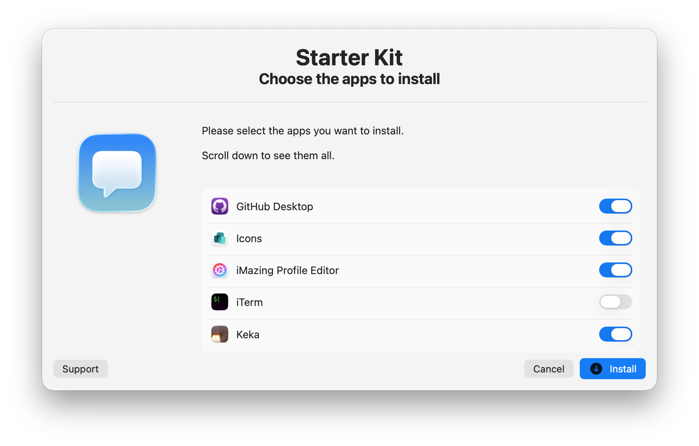
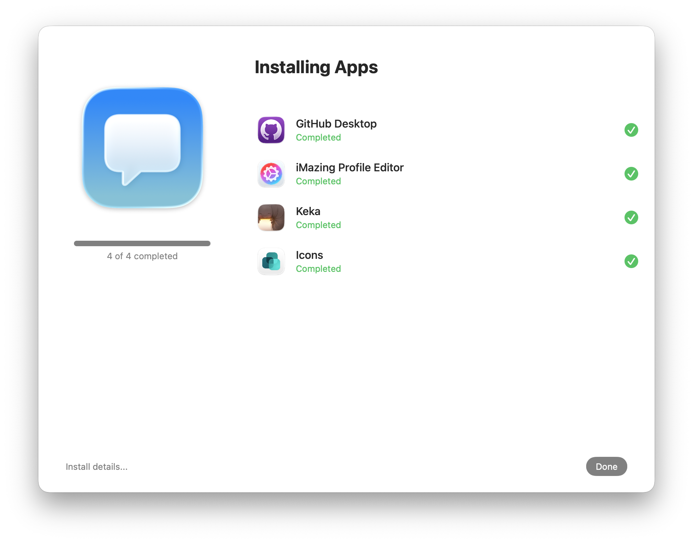

# dialog-starterkit

Starter Kits give end users a simple way to select and install a group of apps relevant to their role. Users can keep working while apps install in the background.

For MacAdmins, Starter Kits keep enrolment lean and generic. Instead of maintaining many enrolment workflows, users pick the apps they need from Self Service.

**Version:** 2.0.0 (17/08/2026)  
**Requires:** macOS 15+ (includes system `jq`), SwiftDialog 3.1.0+, Jamf

This release modernises the starter kit to zsh, checkbox selection, and SwiftDialog Inspect Mode for install progress.

# Workflow

1. Validate macOS 15+, Jamf, and a logged-in console user.
2. Ensure SwiftDialog 3.1.0+ is installed (Jamf trigger when missing), then verify the dialog icon path.
3. Exit without prompting when a Zoom or Teams meeting appears active.
4. Validate the app catalogue and cache branding icons where possible.
5. Present a timed checkbox selection dialog with Install, Cancel, and Support.
6. Launch SwiftDialog Inspect Mode (preset 1) for the selected apps only.
7. Install each selected app with `jamf policy -event`, retrying up to three times and verifying the app path.
8. On success, auto-close the progress window after 60 seconds (Done remains available sooner). On failure, show a summary dialog.

# Configuration

Edit the **VARIABLES TO EDIT** section at the top of `dialog_starterkit.sh`.

### Branding

| Variable | Purpose |
|----------|---------|
| `ICON` | Company / Self Service logo path used in dialogs |
| `SUPPORT_URL` | URL opened by the Support info button |
| `ICON_BASE_URL` | Public URL prefix for per-app PNG icons |
| `MANAGEMENT_DIR` | Working directory for icons and logs (default `/Library/Management/Dialog-StarterKit`) |

### App catalogue

The `APPS` array defines what can be installed. Each entry is:

`FriendlyName,Location,JamfTrigger`

- **FriendlyName** — label shown to the user  
- **Location** — absolute install path used to detect success / already installed  
- **JamfTrigger** — custom event trigger; also the icon filename (`trigger.png`)

```bash
APPS=(
  "iTerm,/Applications/iTerm.app,install_iterm"
  "GitHub Desktop,/Applications/GitHub Desktop.app,install_githubdesktop"
)
```

### Icons

Icons are cached under `${MANAGEMENT_DIR}/Branding/Icons/`. Host PNGs at `${ICON_BASE_URL}/${trigger}.png`. Missing or non-image downloads are discarded (object stores often return XML error bodies with HTTP 200). Apps without a usable icon still appear; the icon key is omitted so SwiftDialog does not exit 202.

### Dependencies

| Tool | Notes |
|------|-------|
| SwiftDialog | Installed via `install_swiftdialog` when missing or below 3.1.0 (change `SWIFTDIALOG_INSTALL_TRIGGER` if needed) |
| jq | Shipped with macOS 15+ at `/usr/bin/jq`; no separate install |

The macOS 15+ requirement covers both SwiftDialog 3 and system `jq`.

### Jamf Parameter 4

Optional **Testing Mode**. When `true`, Jamf install triggers and destructive file operations are logged and skipped.

# Notes

- Designed to run from a Jamf policy as root; SwiftDialog is launched as root with it.
- Temporary workspace is widened from `mktemp`'s 0700 to 755 (files 644). SwiftDialog cannot read a 0700 directory and exits 202.
- Inspect Mode preset 1 does not reliably show or update the config `message`; completion is signalled by the window closing itself.
- Selection height defaults to 450 (`SELECTION_DIALOG_HEIGHT`). Auto-close delay is `INSPECT_AUTO_CLOSE_SECONDS` (60).

# Screenshots

### App selection



### App install (Inspect Mode)



# Version History

### 2.0.0 (17/08/2026)
- Modernised to zsh with SwiftDialog 3 Inspect Mode, icon validation, meeting deferral, install retries, Support button, and 60s auto-close
- Requires macOS 15+ (system `jq`) and SwiftDialog 3.1.0+

### 1.0.1 (18/10/2023)
- Initial public bash starter kit with checkbox selection and command-file install progress
